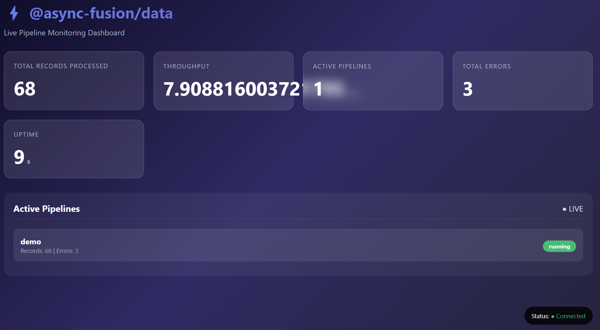

# Dashboard

## Overview

The Live Dashboard provides real-time monitoring and visualization for your data pipelines. It displays metrics such as records processed, throughput, active pipelines, errors, and more through a WebSocket connection.

## Features

- Real-time Metrics: Live updates of pipeline performance
- Multi-pipeline Support: Monitor multiple pipelines simultaneously
- Automatic Dashboard Management: Singleton pattern ensures one dashboard instance
- WebSocket Communication: Efficient real-time data transfer
- Error Tracking: Visual indication of pipeline errors
- Throughput Monitoring: Records per second metrics

## Installation

```bash
npm install @async-fusion/data
```

## Quick Start

### Basic Usage with Pipeline

```javascript
const { PipelineBuilder } = require('@async-fusion/data');

// Create a pipeline with dashboard enabled
const pipeline = new PipelineBuilder({ name: 'my-pipeline' })
    .enableDashboard(3000)  // Dashboard on port 3000
    .source('kafka', {
        topic: 'input-topic',
        brokers: ['localhost:9092']
    })
    .transform(data => {
        // Your transformation logic
        return { ...data, processed: true };
    })
    .sink('console', {});

// Run the pipeline
await pipeline.run();
```

### Standalone Dashboard

```javascript
const { dashboardManager } = require('@async-fusion/data');

// Start dashboard on port 3000
dashboardManager.start(3000);

// Record metrics manually
dashboardManager.recordMetric('my-pipeline', 100, 0);  // 100 records, 0 errors

// Stop dashboard
dashboardManager.stop();
```

## API Reference

### PipelineBuilder.enableDashboard()

Enables the live dashboard for a pipeline.

```typescript
enableDashboard(port?: number): this
```

**Parameters:**

- `port` (number, optional): Port number for the dashboard. Default: 3000

**Returns:** this (for method chaining)

**Example:**

```javascript
const pipeline = new PipelineBuilder({ name: 'sales-pipeline' })
    .enableDashboard(8080)  // Dashboard on port 8080
    .source('kafka', { topic: 'sales' });
```

### dashboardManager

Singleton manager for controlling the dashboard.

#### dashboardManager.start()

Starts the dashboard server.

```typescript
start(port: number): void
```

**Parameters:**

- `port` (number): Port number for the dashboard

**Example:**

```javascript
const { dashboardManager } = require('@async-fusion/data');
dashboardManager.start(3000);
```

#### dashboardManager.recordMetric()

Records metrics for a pipeline.

```typescript
recordMetric(pipelineName: string, records: number, errors: number): void
```

**Parameters:**

- `pipelineName` (string): Name of the pipeline
- `records` (number): Number of records processed
- `errors` (number): Number of errors encountered

**Example:**

```javascript
dashboardManager.recordMetric('clickstream', 1000, 2);
```

#### dashboardManager.stop()

Stops the dashboard server.

```typescript
stop(): void
```

## Real-World Examples

### Example 1: Kafka Streaming Pipeline with Dashboard

```javascript
const { PipelineBuilder } = require('@async-fusion/data');

const pipeline = new PipelineBuilder({
    name: 'clickstream-processor',
    checkpointLocation: './checkpoints'
})
    .enableDashboard(3000)
    .source('kafka', {
        topic: 'clickstream',
        brokers: ['kafka1:9092', 'kafka2:9092'],
        groupId: 'dashboard-consumer'
    })
    .transform(data => {
        // Enrich clickstream data
        return {
            ...data,
            enrichedAt: new Date().toISOString(),
            userAgent: parseUserAgent(data.userAgent)
        };
    })
    .transform(data => {
        // Filter bot traffic
        if (data.isBot) return null;
        return data;
    })
    .sink('kafka', {
        topic: 'enriched-clickstream',
        brokers: ['kafka1:9092', 'kafka2:9092']
    });

await pipeline.run();
```

### Example 2: File Processing Pipeline with Error Tracking

```javascript
const { PipelineBuilder } = require('@async-fusion/data');
const fs = require('fs');

const pipeline = new PipelineBuilder(
    { name: 'log-processor' },
    {
        retryConfig: {
            maxAttempts: 3,
            delayMs: 1000,
            backoffMultiplier: 2
        },
        errorHandler: (error, context) => {
            console.error(`Pipeline error: ${error.message}`);
            // Send alert to monitoring system
        }
    }
)
    .enableDashboard(3000)
    .source('file', {
        filePath: '/var/logs/app.log',
        format: 'line'
    })
    .transform(line => {
        // Parse log line
        const parsed = parseLogLine(line);
        if (parsed.level === 'ERROR') {
            throw new Error(`Log error: ${parsed.message}`);
        }
        return parsed;
    })
    .sink('database', {
        connectionString: 'postgresql://localhost:5432/logs',
        table: 'app_logs'
    });

await pipeline.run();
```

### Example 3: Multiple Pipelines Sharing Dashboard

```javascript
const { PipelineBuilder } = require('@async-fusion/data');

const PORT = 3000;

// First pipeline - starts the dashboard
const userActivityPipeline = new PipelineBuilder({ name: 'user-activity' })
    .enableDashboard(PORT)
    .source('kafka', { topic: 'user-events' })
    .transform(data => enrichUserData(data))
    .sink('database', { table: 'user_activity' });

// Second pipeline - reuses existing dashboard
const salesPipeline = new PipelineBuilder({ name: 'sales-analytics' })
    // No enableDashboard needed - dashboard already running
    .source('kafka', { topic: 'sales' })
    .transform(data => calculateRevenue(data))
    .sink('database', { table: 'daily_sales' });

// Third pipeline - also reuses dashboard
const errorPipeline = new PipelineBuilder({ name: 'error-monitoring' })
    .source('kafka', { topic: 'errors' })
    .transform(data => categorizeError(data))
    .sink('console', {});

// Run all pipelines concurrently
await Promise.all([
    userActivityPipeline.run(),
    salesPipeline.run(),
    errorPipeline.run()
]);
```

### Example 4: Real-time Dashboard with Custom Metrics

```javascript
const { dashboardManager } = require('@async-fusion/data');
const { KafkaConsumer } = require('@async-fusion/data');

// Start standalone dashboard
dashboardManager.start(3000);

// Custom consumer with manual metric recording
const consumer = new KafkaConsumer({
    brokers: ['localhost:9092'],
    clientId: 'metrics-collector'
}, 'metrics-topic', 'dashboard-group');

let recordCount = 0;
let errorCount = 0;

consumer.on(async (message) => {
    recordCount++;

    // Process message
    try {
        await processMessage(message);
    } catch (error) {
        errorCount++;
    }

    // Update dashboard metrics every 100 records
    if (recordCount % 100 === 0) {
        dashboardManager.recordMetric('custom-processor', recordCount, errorCount);
    }
});

await consumer.connect();
await consumer.start();
```

## Dashboard Interface

### Accessing the Dashboard

Open your browser and navigate to:

```text
http://localhost:3000
```

### Dashboard Sections

| Section | Description |
|---------|-------------|
| Total Records | Cumulative records processed across all pipelines |
| Throughput | Records processed per second |
| Active Pipelines | Number of currently running pipelines |
| Total Errors | Cumulative error count |
| Uptime | Dashboard runtime duration |
| Pipelines List | Individual pipeline metrics |



### Dashboard Features

- Real-time updates: Metrics refresh every second
- Auto-reconnect: Dashboard automatically reconnects if connection drops
- Responsive design: Works on desktop and tablet devices
- Live indicator: Visual indication of active WebSocket connection

## Configuration Options

### Dashboard Port

```javascript
// Default port (3000)
pipeline.enableDashboard();

// Custom port
pipeline.enableDashboard(8080);
```

### Pipeline Options

```javascript
const pipeline = new PipelineBuilder(
    { name: 'my-pipeline' },
    {
        retryConfig: {
            maxAttempts: 5,        // Maximum retry attempts
            delayMs: 1000,         // Initial delay in ms
            backoffMultiplier: 2   // Exponential backoff multiplier
        },
        errorHandler: (error, context) => {
            // Custom error handling
            console.error(error);
        }
    }
);
```

## Troubleshooting

### Port Already in Use

**Error:** `EADDRINUSE: address already in use`

**Solution:** Change the port or stop the existing process

```javascript
// Use a different port
pipeline.enableDashboard(3001);
```

### Dashboard Not Connecting

**Solution:** Check if the dashboard is started and port is accessible

```javascript
// Ensure dashboard is started
dashboardManager.start(3000);
console.log('Dashboard running at http://localhost:3000');
```

### No Metrics Appearing

**Solution:** Verify metrics are being recorded

```javascript
// Manually record a test metric
dashboardManager.recordMetric('test-pipeline', 100, 0);
```

## Best Practices

### 1. Use a Single Dashboard Port

```javascript
// GOOD: One dashboard for all pipelines
const PORT = 3000;
pipeline1.enableDashboard(PORT);
pipeline2.enableDashboard(PORT);  // Reuses existing
```

### 2. Start Dashboard Early

```javascript
// GOOD: Start dashboard before pipelines
dashboardManager.start(3000);
// ... create and run pipelines
```

### 3. Handle Errors Gracefully

```javascript
const pipeline = new PipelineBuilder(
    { name: 'production-pipeline' },
    {
        errorHandler: (error, context) => {
            dashboardManager.recordMetric('errors', 0, 1);
            // Send to external monitoring
        }
    }
);
```

### 4. Stop Dashboard on Shutdown

```javascript
process.on('SIGINT', () => {
    dashboardManager.stop();
    process.exit();
});
```

## Performance Considerations

| Metric | Value |
|--------|-------|
| WebSocket Overhead | < 1ms per message |
| Memory Usage | ~50MB for dashboard |
| CPU Usage | < 1% idle, ~5% under load |
| Max Concurrent Pipelines | Unlimited (limited by system) |
| Metrics Update Frequency | 1 second |

## API Reference Summary

```javascript
// Enable dashboard on pipeline
pipeline.enableDashboard(port?: number)

// Dashboard Manager
dashboardManager.start(port: number)
dashboardManager.recordMetric(name: string, records: number, errors: number)
dashboardManager.stop()
dashboardManager.getDashboard()

// Standalone Dashboard
const dashboard = new LiveDashboard({ port: number })
dashboard.start()
dashboard.recordMetric(name: string, records: number, errors: number)
dashboard.stop()
```

[⬆ Back to Top](#dashboard)
